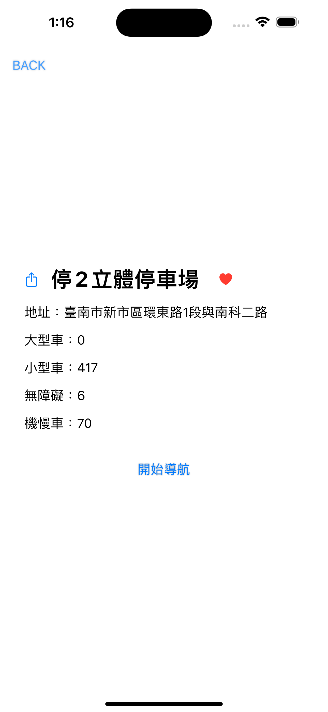

# LINE Parking

## 功能設計與特色
- 主畫面 UI 用 LINE 的聊天畫面
- 主畫面顯示搜尋停車場按鈕及收藏清單按鈕
- 可以根據指定交通工具篩選停車場
- 可以收藏停車場至收藏清單
- 可以分享停車場資訊

## Kanban
用 GitHub Project 的 Kanban 來管理 Task 進度

  

## Demo
<video width="320" height="240" controls>
    <source src="DEMO/video.mp4" type="video/mp4">
</video>

  
  

## Screenshot

  

  

  

  

  

  

  

